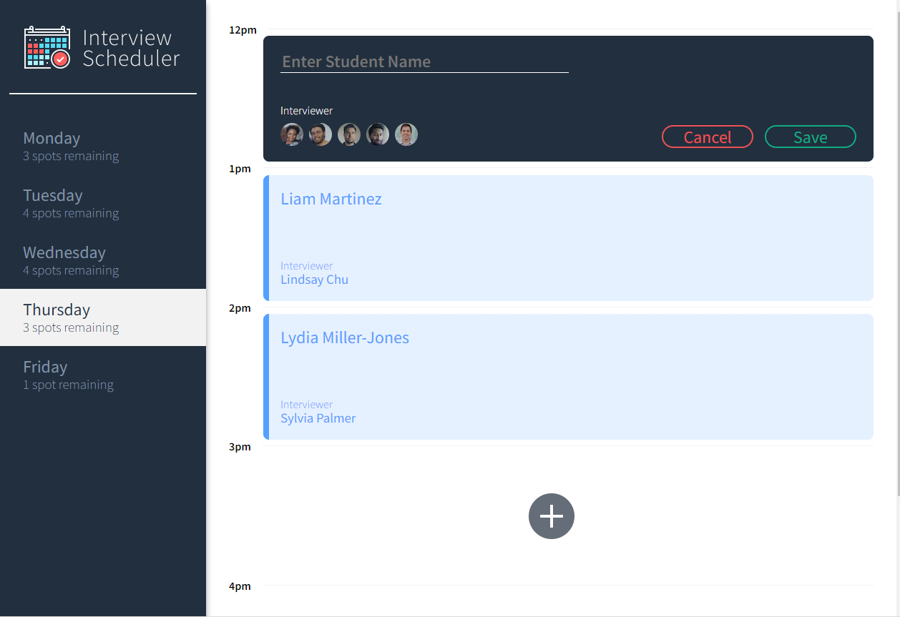

# Interview Scheduler

Interview Scheduler is a single-page application (SPA) built with [React](https://reactjs.org/) that allows users to book technical interviews between students and mentors. Appointments can be between the hours of 12 PM and 5 PM, Monday to Friday. Each appointment has one student and one interviewer. When creating a new appointment, the user can enter any student name while the interviewer is chosen from a predefined list. The user can save the appointment and view the entire schedule of appointments on any day of the week. Appointments can also be edited or deleted. The front end of this project is built with React and makes requests to an API to fetch and store appointment data from a database.

## Final product


## Installation


1. Fork and Clone the repository to your local working directory:

```sh
git clone git@github.com:anaProdigy/Interview-Scheduler.git
```

2. Install dependencies 

```sh
 npm install
```

3. Start Client Side (Webpack Development Server)

```sh
npm start
```


4. Start Server Side [Interview Scheduler API](https://github.com/anaProdigy/Interview-Scheduler-Api):

```sh
npm start
```
The app also requires the [Interview Scheduler API](https://github.com/anaProdigy/Interview-Scheduler-Api) to be installed separately, and a [PostgreSQL](https://www.postgresql.org/) database set up and running. Instructions are provided in the Scheduler API [README](https://github.com/anaProdigy/Interview-Scheduler-Api#readme).

The Client side will be automatically opened in a browser at `http://localhost:8000/`.

The Server side will run at `http://localhost:8001/`


## Testing

### Running Jest Test Framework

```sh
npm test
```

### Running Storybook Visual Testbed

```sh
npm run storybook
```
Go to `http://localhost:9009/` to see storybook
## Dependencies

 - [React](https://reactjs.org/)
 - [axios](https://www.npmjs.com/package/axios)
 - [classnames](https://www.npmjs.com/package/classnames)
 - [normalize](https://www.npmjs.com/package/normalize)


## Development dependencies

 - [Babel](https://babeljs.io/)
 - [Storybook](https://storybook.js.org/)
 - [react-test-renderer](https://reactjs.org/docs/test-renderer.html)
 - [Testing library](https://testing-library.com/)
 - [sass](https://www.npmjs.com/package/sass)
 - [prop-types](https://www.npmjs.com/package/prop-types)
 


## Project boilerplate

The project was created using this [boilerplate](https://github.com/lighthouse-labs/scheduler/)

